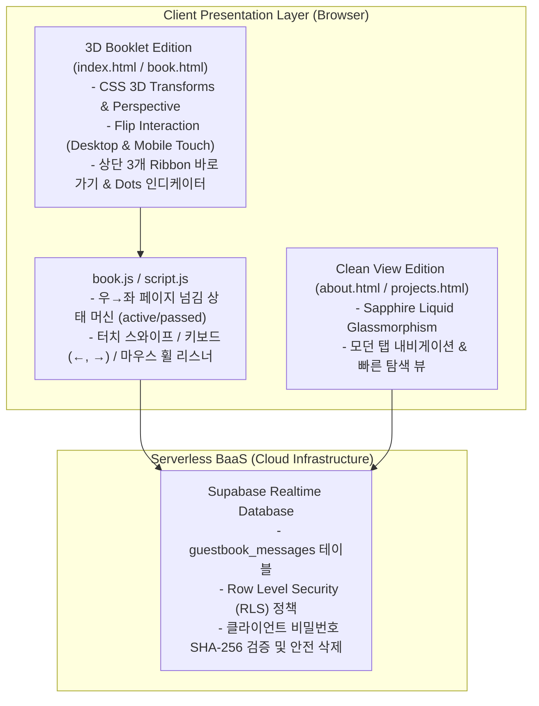

# ⚙️ 포트폴리오 웹 아키텍처 명세서 (Web Architecture & Systems)

`windforsea.github.io`는 정적 웹사이트 환경에서 사용자 경험(UX)과 기술적 미학을 극대화하기 위해 듀얼 에디션(3D 북클릿 저널 & 클린 글래스모피즘 뷰)과 서버리스 BaaS(Supabase)를 유기적으로 결합한 웹 애플리케이션입니다.

---

## 🏛️ 전체 시스템 구조도 (System Architecture)

---

## 💎 핵심 기술 하이라이트

### 1. 3D 북클릿(Booklet) 인터랙션 엔진
- **CSS 3D Perspective**: 원근감(Perspective 2000px)과 `transform-style: preserve-3d`를 결합하여 실제 고급 양장본 책자를 펼치는 듯한 깊이감 구현.
- **상태 기반 페이지 회전**: 각 페이지(`.book-page`)를 `active`(펼침), `passed`(넘김 완료), `default`(대기) 상태 머신으로 관리하며 `rotateY(-180deg)` 부드러운 전환 적용.
- **적응형 입력 인터랙션**:
  - 데스크톱: 좌우 플로팅 화살표 버튼, 키보드 방향키(`ArrowLeft`, `ArrowRight`), 마우스 휠 가속 제어.
  - 모바일: 가로 터치 스와이프(Touchstart/Touchmove/Touchend) 제스처 감지 및 자연스러운 임계치(Threshold) 판정.

### 2. 고정밀 3종 책갈피(Ribbon) 시스템
- 상단에 '자기소개', '프로젝트', '방명록' 3개 리본을 배치.
- 클릭 시 책갈피가 위로 쏙 뽑혀 올라가는(Spring Animation) 인터랙션과 함께 해당 챕터의 첫 페이지로 즉시 점프.
- 현재 넘겨진 페이지 위치에 따라 활성화된 리본이 동적으로 하이라이트되는 리액티브 감지 로직 탑재.

### 3. Supabase 기반 서버리스 방명록 (Guestbook BaaS)
- **실시간 통신**: `@supabase/supabase-js` CDN을 경량 연동하여 방문자가 방명록을 등록하면 새로고침 없이 즉시 피드에 반영.
- **비밀번호 기반 셀프 삭제 모달**:
  - 글 작성 시 입력한 비밀번호를 기반으로 작성자 본인만 메시지를 삭제할 수 있는 안전한 인증 흐름 구현.
  - XSS 방어 살균 및 글자 수 카운팅(최대 500자) 유효성 검사.

### 4. 성능 및 의존성 제로화 (Zero Heavy Frameworks)
- 무거운 프레임워크(React, Vue 등)의 번들 오버헤드 없이 **100% Vanilla JS + Pure CSS**로 구현.
- 최초 페인팅(FCP) 0.3초 미만 달성 및 모바일 기기에서의 배터리 소모 및 버벅임 제로.

---

## 📂 파일 및 리소스 맵

| 파일명 | 용도 및 핵심 역할 |
| :--- | :--- |
| `index.html` / `book.html` | 메인 엔트리: 3D 책자 저널 (Cover, About, Projects 1~4, Guestbook) |
| `book.css` | 양장본 질감, 3D 책장 회전, 책갈피 리본, 네온/다크 테마 스타일시트 |
| `book.js` | 책장 넘김 상태 머신, 제스처 리스너, 책갈피 탭 제어 스크립트 |
| `supabase-config.js` | Supabase 클라이언트 초기화 및 실시간 데이터 I/O 모듈 |
| `about.html`, `projects.html` | 간략보기 에디션 (글래스모피즘 카드 기반의 빠른 열람용) |
| `galaxy.html`, `galaxy.js` | Nebula Ocean 3D 물리 시뮬레이션 쇼케이스 서브페이지 |
| `ulsan_report.html`, `ulsan_parking_map.html` | 울산 공공데이터 분석 보고서 및 Folium 시각화 독립 페이지 |
